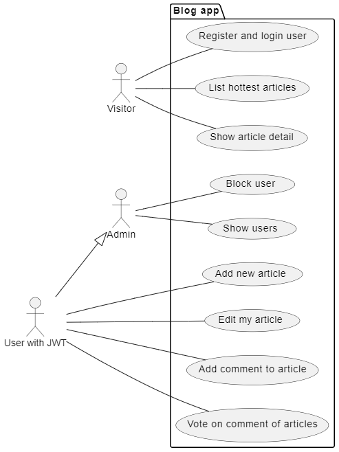
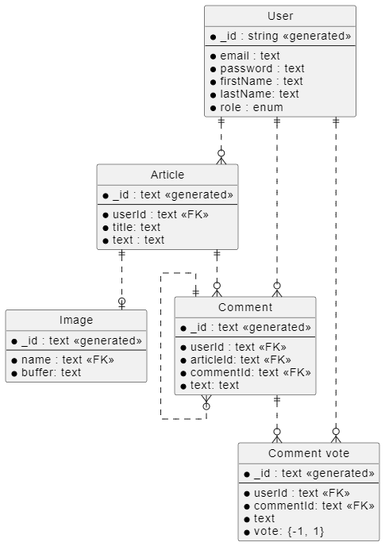

# Applifting - test - BE for blog app

## Use cases:



## Entity Relations:



## Features
 - PlantUML scripting language for generating UML diagrams
 - Express + MongoDB ([Mongoose](http://mongoosejs.com/))
 - Consistent coding styles with [editorconfig](http://editorconfig.org)
 - Uses [helmet](https://github.com/helmetjs/helmet) to set some HTTP headers for security
 - Load environment variables from .env files with [dotenv](https://github.com/rolodato/dotenv-safe)
 - Request validation with [joi](https://github.com/hapijs/joi)
 - Linting with [eslint](http://eslint.org)
 - Tests with [mocha](https://mochajs.org), [chai](http://chaijs.com) and [sinon](http://sinonjs.org)
 - Code coverage with [istanbul](https://istanbul.js.org) and [coveralls](https://coveralls.io)
 - Git hooks with [husky](https://github.com/typicode/husky) 
 - Logging with [morgan](https://github.com/expressjs/morgan)
 - Authentication and Authorization with [passport](http://passportjs.org)
 - API documentation generation with [apidoc](http://apidocjs.com)
 - Continuous integration support with Github Actions

## Requirements

 - [Node v7.6+](https://nodejs.org/en/download/current/) or [Docker](https://www.docker.com/)
 - [Yarn](https://yarnpkg.com/en/docs/install)

## Getting Started

#### Install dependencies:

```bash
yarn
```

#### Set environment variables:

```bash
cp .env.example .env
```

## Test

```bash
# run all tests with Mocha
yarn test

# run unit tests
yarn test:unit

# run integration tests
yarn test:integration

# open nyc test coverage reports
yarn coverage
```

## Validate

```bash
# run lint and tests
yarn validate
```

## Documentation

```bash
# generate and open api documentation
yarn docs
```

## Docker

```bash
# run container locally
yarn docker:dev

# run container in production
yarn docker:prod

# run tests
yarn docker:test
```